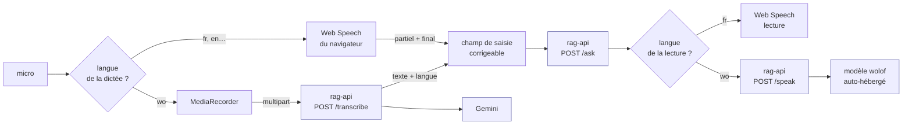

# Vocal du chat — dictée et lecture (`/chat/**`)

> Entrée et sortie vocales de **Sira**. Doc canonique du sujet ; la vue d'ensemble du module reste
> [`banc-essai-chat.md`](./banc-essai-chat.md).
>
> **Le vocal est ADDITIF** : tout reste utilisable au clavier sans lui. Un moteur absent ne dégrade
> rien — il retire un bouton.

## 1. Deux chemins depuis le 2026-09-04 — et le second passe par nos serveurs

Le chemin d'origine, **inchangé**, tout dans le navigateur :

```
micro → ASR du navigateur → texte → POST /ask (SSE) → texte → TTS
```

Le chemin **serveur**, ajouté pour le wolof — dictée **et**, depuis le 2026-09-05, lecture :

```
micro → MediaRecorder → POST /transcribe → texte → POST /ask (SSE) → texte → POST /speak → audio
```



**Ce que la sélection décide, et rien d'autre** : quel moteur reçoit le micro,
et quel moteur lit. Tout le reste — états du bouton, barge-in, découpage en
phrases, nettoyage avant lecture — est commun aux deux chemins.

**La lecture suit la même règle que la dictée** : Web Speech en français, où il
est gratuit et instantané ; le moteur serveur en wolof, où **aucune voix
n'existe côté navigateur**. Sans cette sélection par langue, `speechSynthesis`
lirait une réponse wolof avec une voix française — du charabia, là où l'absence
de bouton aurait été honnête.

⚠️ Une phrase par appel à `/speak`, et la promesse de `parler()` les sérialise :
c'est le tampon de phrases existant qui découpe, rien n'a changé de ce côté.
Compter ~0,6 s de synthèse par phrase sur le serveur, avant qu'elle ne commence
à se jouer.

> Ce document affirmait : « le jour où le vocal demandera du serveur, ce sera un **autre chantier**
> avec son propre chiffrage — pas une extension discrète de celui-ci ». **Ce jour est arrivé**, et
> le chantier a bien eu lieu côté API (étape 12 de `rag-platform`). Côté web, l'ajout est resté
> contenu parce que le moteur était isolé (§6) : un fichier de moteur, la sélection par langue, et
> la mention de gouvernance. Ce qui a changé au-delà du moteur est listé ici même, pas dissimulé.

Ce que ce second chemin change, et qu'il faut lire avant d'y toucher :

- **`POST /ask` ne bouge toujours pas** : il reçoit du texte, comme une question tapée ;
- **`POST /transcribe` est un endpoint de plus**, sur la même origine que `/ask` — donc **aucune
  entrée `connect-src` nouvelle**, l'origine de l'API y est déjà (`nuxt.config.ts`) ;
- **le jeton de session est partagé** avec le chat (`gestionnaireJetonPartage`) : deux jetons pour
  un même visiteur, ce serait deux `/session` sur un quota de 20/min partagé par tout un bureau ;
- **l'audio transite par nos serveurs**, ce qui rend fausse la mention affichée jusqu'ici — voir
  §5, c'est le point le plus important de cette évolution.

## 1 bis. Langue de l'échange — constatée, jamais redevinée (2026-09-05)

Avec deux moteurs de lecture, il a fallu **choisir** — et le choix se faisait sur
un réglage de session (`voiceLang`), pas sur le contenu à lire. Une variante en
`wo-SN` faisait lire une réponse **française** par le modèle wolof ; l'inverse
donnait du charabia.

La langue est donc devenue un **attribut de l'échange**, porté d'un bout à
l'autre :

```
dictée → POST /transcribe rend {text, lang}   ← ENTENDUE par le moteur
   ↓
langueEchange (Shell.vue)  ← ou choix explicite dans le sélecteur
   ↓
POST /ask reçoit lang  →  la réponse est dans cette langue
   ↓
moteurLecture(lang)    →  web-speech en fr, rag-serveur en wo
```

- **`null` par défaut, et ce n'est pas un oubli.** Sans langue déclarée, le champ
  n'est **pas envoyé** et l'API répond dans la langue de la question — le
  comportement historique. Envoyer un défaut ferait répondre en français à un
  visiteur qui écrit autrement.
- **Le sélecteur affiche `Auto / Français / Wolof`** et la dictée le préremplit
  avec ce qu'elle a entendu.
- **Aucune détection dans le navigateur.** Redétecter la langue d'un texte que
  l'on vient de produire, c'est jeter une information qu'on possédait — et se
  tromper sur le cas central de ce corpus : du wolof truffé de termes
  administratifs français. Raisonnement complet et alternatives écartées :
  [ADR](../../../../rag-platform/docs/decisions/2026-09-05-langue-de-lechange.md).

## 2. ⚠️ Deux en-têtes qui ne se voient qu'en production

**En développement, `security.headers` vaut `false`** : ni `Permissions-Policy` ni la CSP
n'existent. Tout ce qui les concerne marche en local et échoue en ligne. Ce module s'est fait
prendre **deux fois**, sur deux directives différentes.

### 2 bis. `media-src` — la lecture wolof bloquée par la CSP (2026-09-05)

Symptôme : les trois appels `POST /speak` reviennent en **200**, l'audio arrive, et **rien ne se
lit**. Console :

```
Loading media from 'blob:https://www.vie-publique.sn/…' violates the Content Security
Policy directive: "default-src 'self'". Note that 'media-src' was not explicitly set,
so 'default-src' is used as a fallback.
```

`media-src` n'était pas déclarée : la CSP retombait sur `default-src 'self'`, qui refuse `blob:` et
`data:`. Or l'audio de `/speak` arrive en **blob** et l'amorce iOS est une **data-URL**. Le réseau
était irréprochable, le navigateur refusait le média.

Correctif dans `nuxt.config.ts` :

```ts
'media-src': ["'self'", 'blob:', 'data:'],
```

> ⚠️ **Vérifier sur le BUILD, pas en dev** : `npm run build && npm run preview`, puis
> `curl -sI http://localhost:3000/chat/gemini | grep -i content-security-policy`. C'est la seule
> façon de voir cet en-tête avant la mise en ligne.

## 2 ter. `Permissions-Policy` — le piège qui ne se voit qu'en production

`nuxt-security` pose par défaut `permissionsPolicy: { microphone: [] }`, sérialisé en
**`Permissions-Policy: microphone=()`** : le micro est interdit sur **tout le site**.

Et **en développement, `security.headers` vaut `false`** : cet en-tête n'existe pas. Un micro qui
marche en local ne prouve donc **rien** pour la production. C'est le pire des scénarios — la panne
n'apparaît qu'après déploiement.

Le correctif est **scopé aux seules pages de conversation** (`nuxt.config.ts`) :

```ts
'/chat/**': { security: { headers: { permissionsPolicy: { microphone: ['self'] } } } },
```

`(self)` **n'accorde rien** : il rend seulement la demande de permission *possible*. L'utilisateur
doit toujours l'accorder dans son navigateur. Le reste du site conserve `microphone=()`.

La politique par défaut est aussi rendue **explicite** dans `securityConfig` : sans ces cinq lignes
sous les yeux, personne ne devine que le site interdit le micro partout.

**Vérification — jamais en dev :**

```bash
npm run build && npm run preview
curl -sI http://localhost:3000/chat/gemini | grep -i permissions-policy   # microphone=(self)
curl -sI http://localhost:3000/               | grep -i permissions-policy   # microphone=()
```

## 3. Compatibilité — détection de fonctionnalité, jamais de reniflage

| Cible | Dictée (ASR) | Lecture (TTS) |
| --- | --- | --- |
| Chrome, Edge (desktop & Android) | ✅ `webkitSpeechRecognition` | ✅ |
| Safari macOS / iOS ≥ 14.5 | ✅ | ✅ |
| **Chrome iOS** | ✅ **mesuré 04/08/2026** — double invite : reconnaissance vocale système (Apple), puis micro du site | ✅ |
| **Firefox** | ❌ API absente (flag `media.webspeech.recognition.enable`, off) | ✅ |
| **App Android (TWA)** | ✅ attendu — c'est Chrome | ✅ attendu |
| **App iOS (WKWebView)** | ⚠️ **API PRÉSENTE, permission refusée** — mesuré 04/08/2026, voir §4 | ✅ **mesuré** (2 voix `fr-FR`) |

> ⚠️ **Correction du 04/08/2026.** Cette doc affirmait d'abord que
> `webkitSpeechRecognition` était *absent* de WKWebView. **C'est faux** : la sonde relevée dans
> l'app iOS publiée affiche `dictée ✅ web-speech`. L'API est bien là ; c'est la **permission** qui
> est refusée, et pour une raison réparable (§4). La leçon est celle du `CLAUDE.md` : ne pas
> conclure sans mesurer sur la cible réelle.

**Là où la dictée manque, le bouton micro n'est pas rendu du tout.** Jamais de bouton mort. C'est
`moteurEcoute()` / `moteurLecture()` (`app/lib/voice/index.ts`) qui en décide, à l'exécution.

### Relever la compatibilité sur un appareil réel

Les apps des stores ne se testent pas depuis un poste de développement. Le pied de conversation
(« Détails », sous la saisie) affiche donc une **sonde** :

```
Voix   dictée ✅ web-speech · lecture ✅ · 4 voix fr-FR
```

Ouvrir `/chat/gemini` dans l'app installée, déplier « Détails », relever la ligne. Pas de page de
diagnostic à maintenir, et ça sert la vocation de traçabilité du banc.

## 4. App iOS : l'API est là, la permission manque — et c'est réparable

**Mesuré le 04/08/2026 dans l'app publiée** (sonde du pied de conversation) :

```
Voix   dictée ✅ web-speech · lecture ✅ · 2 voix fr-FR
```

Puis, au clic sur le micro : « L'accès au micro a été refusé. Vous pouvez poser votre question au
clavier. » La dégradation prévue fonctionne, mais la dictée est inutilisable.

**Cause, trouvée dans le wrapper** (`~/Projects/VP/mobile/Vie Publique SN/src`, voir aussi
[`../../project/pwa-mobile.md`](../../project/pwa-mobile.md)) :

| Clé `Info.plist` | Présente ? |
| --- | --- |
| `NSMicrophoneUsageDescription` | ✅ (gabarit PWABuilder) |
| `NSCameraUsageDescription` | ✅ |
| **`NSSpeechRecognitionUsageDescription`** | ❌ **absente** |

Sur iOS, la reconnaissance vocale exige **sa propre** clé d'usage, distincte de celle du micro. Sans
elle, le système refuse. La preuve par comparaison, sur le même téléphone : dans **Chrome iOS**, le
système demande d'abord « "Chrome" souhaite accéder à la reconnaissance vocale — les données
vocales seront envoyées à Apple », **puis** « Autoriser www.vie-publique.sn à utiliser le micro ? ».
Deux permissions distinctes ; l'app n'en déclare qu'une.

S'y ajoute probablement le délégué
`webView(_:requestMediaCapturePermissionFor:initiatedByFrame:type:decisionHandler:)`, **absent** de
`WebView.swift` : sur iOS 15+, sans lui, WKWebView refuse automatiquement toute capture.

> **Le micro sur l'app iOS est un problème de CONFIGURATION NATIVE, pas d'API.** Aucun moteur
> serveur n'est nécessaire : `webkitSpeechRecognition` fonctionne dans WKWebView, il n'a simplement
> pas le droit de s'exécuter.

**Ce que ça coûte :**

1. ajouter `NSSpeechRecognitionUsageDescription` à `Info.plist` (une chaîne, rédigée pour l'App
   Store) ;
2. ajouter le délégué de capture média à `WebView.swift` (~8 lignes) si le micro reste refusé après
   le point 1 ;
3. rebuild PWABuilder + **re-soumission App Store**.

### ✅ Corrigé et vérifié sur appareil — 04/08/2026, build **1.1 (5)**

Les deux points ont été livrés (`NSSpeechRecognitionUsageDescription` + le délégué
`requestMediaCapturePermissionFor`, qui n'accorde la capture qu'aux `allowedOrigins`). **Testé sur
iPhone via TestFlight**, la séquence attendue se déroule enfin :

1. carte de consentement du site (« Votre voix est transmise au service de reconnaissance vocale… ») ;
2. invite système **« Vie Publique SN souhaite accéder à la reconnaissance vocale »** ;
3. invite système **« Vie Publique SN souhaite accéder au micro »** ;
4. dictée transcrite dans la saisie, question envoyée, réponse sourcée.

C'est exactement la séquence observée dans Chrome iOS, celle qui manquait. Les textes affichés
dans les deux invites sont ceux d'`Info.plist` — les relire si la formulation doit évoluer, ils
sont **soumis à la revue App Store**.

> Le correctif avait été préparé pour le build **4**, jamais archivé ni uploadé. Il est parti avec
> le lot des notifications push, d'où sa livraison dans le 1.1 (5).

## 4 bis. La LECTURE était muette sur iOS — amorce d'activation (04/08/2026)

> ✅ **Corrigé ET VÉRIFIÉ sur iPhone le 04/08/2026** (`amorcer()` sur le moteur, appelée par
> `basculer()`). La lecture fonctionne dans l'app iOS. Correctif **côté web** : aucun nouveau
> build iOS n'a été nécessaire.
>
> ⚠️ Ne se teste **que sur appareil réel** — ni le simulateur ni le desktop n'ont cette
> restriction, un test vert ailleurs ne prouve rien. Et **activer le son AVANT d'envoyer la
> question** : l'amorce ne part qu'au clic. Activer en cours de réponse ne démarre la lecture
> qu'à la phrase suivante — comportement documenté au § Sourdine, pas un bug.

**Symptôme, sur l'app 1.1 (5) :** on active l'icône haut-parleur, **rien n'est lu**. Aucun message
d'erreur. En quittant l'app pour une autre, on entend un **bref bruit** — le son qui aurait dû
sortir, libéré au changement d'état de la session audio.

La **dictée** fonctionne (§4). C'est bien l'autre moitié du vocal qui est en cause.

**Cause — l'amorce d'activation utilisateur n'est jamais jouée.** iOS n'autorise la synthèse que
si le **tout premier** `speechSynthesis.speak()` part **de façon synchrone depuis un geste
utilisateur**. Sans cette amorce, tous les `speak()` suivants sont ignorés **en silence**.

Or [`useLectureVocale.ts`](../../../app/composables/useLectureVocale.ts) fait ceci :

```ts
function basculer() {
  actif.value = !actif.value;   // ← ne fait que lever un drapeau
  if (!actif.value) arreter();
}
```

Le clic sur le haut-parleur **ne déclenche aucun `speak()`**. Les phrases ne partent qu'ensuite,
depuis `traiterFile()`, dans une continuation asynchrone du flux SSE — **hors geste utilisateur**.
iOS refuse, et l'échec est avalé par le `catch` de `traiterFile()` (« un énoncé qui échoue ne doit
pas tuer la lecture »), qui n'écrit qu'un `console.warn`. D'où le silence total, sans erreur visible.

> ⚠️ **Le commentaire du code affirme le contraire** — « le clic d'activation fournit au passage
> l'activation utilisateur que Safari exige avant toute synthèse » (`useLectureVocale.ts`, ~l.34).
> L'intention était juste, l'implémentation ne la réalise pas : lever un booléen ne débloque rien.
> Ne pas se fier à ce commentaire pour conclure que le sujet est traité.

**Correctif appliqué** : `MoteurVocal.amorcer()` (optionnelle — un moteur serveur n'aura pas cette
contrainte) émet un énoncé muet (`' '`, `volume = 0`), et `basculer()` l'appelle **avant** de lever
le drapeau, à l'activation seulement. Le reste de l'architecture n'a pas bougé : tampon de phrases,
sérialisation, ping `resume()`.

Trois détails qui comptent :

- **Aucun `cancel()` derrière l'amorce** — il annulerait l'activation qu'on vient d'obtenir.
- **On ré-amorce à CHAQUE activation**, pas une seule fois : la session audio peut être perdue
  après un passage en arrière-plan.
- `basculer()` doit rester appelée **directement** depuis le `@click`, jamais après un `await` :
  l'amorce ne vaut que dans le geste. C'est le cas dans `Shell.vue`
  (`@click="lecture.basculer()"`), à préserver.

**Points de vigilance pour la vérification :**

- ne se teste **que sur appareil réel** — desktop et simulateur n'ont pas cette restriction, donc
  un test vert ailleurs ne prouve rien (même piège que le push) ;
- vérifier aussi la **reprise après passage en arrière-plan** : c'est là que le « bruit bref »
  apparaît aujourd'hui ;
- le ping `moteur.resume()` toutes les `PING_REPRISE_MS` existe pour le bug de pause de Chrome
  desktop — vérifier qu'il ne produit pas de blip sur iOS une fois l'amorce en place.

**Aucune ligne de code web à changer.** `peutEcouter()` répond déjà `true` : le jour où l'app est
resoumise avec la permission, la dictée s'active seule.

> ⚠️ Avant tout rebuild iOS, vérifier `Settings.swift` / `appDomain` : le repo a déjà pointé
> `dev.vpsn.cloud` alors que l'app publiée vise la prod (cf. `pwa-mobile.md`). Builder le repo tel
> quel enverrait les utilisateurs sur le site de test.

**Comportement en attendant** : le bouton micro s'affiche (l'API existe), le premier appui échoue
avec un message clair, puis le bouton devient inerte avec son infobulle. Ce n'est pas idéal — mais
c'est honnête, ça n'empêche rien au clavier, et c'est **auto-réparateur**. Le masquer demanderait de
détecter l'app iOS, donc de renifler le navigateur : précisément ce que ce module s'interdit.

**L'app Android, elle, n'a rien à faire.** Le TWA affiche le site live et le vocal ne touche à aucun
élément figé au build (nom, icône, `start_url`, domaine, shortcuts) : le vocal y arrive **au
prochain déploiement web, sans passer par le Play Store**.

## 4 ter. Le moteur SERVEUR se heurte au même mur iOS (2026-09-05)

Le contrat disait, à propos de `amorcer()` : « un moteur serveur n'aura pas cette contrainte ».
**C'est faux, et un iPhone l'a montré le jour du déploiement.**

La raison est la même qu'au § 4 bis, la mécanique diffère à peine : le `play()` du moteur serveur
part **après** l'appel réseau à `POST /speak`, donc **hors du geste utilisateur**. iOS le refuse.
Le symptôme, lui, n'est plus le silence total d'août — le message « La lecture à voix haute n'a pas
abouti » s'affiche, parce que les échecs de lecture ne sont plus avalés.

**Correctif** : `amorcer()` est implémentée aussi par `rag-serveur`. Elle joue un WAV vide de
44 octets **dans le clic**, ce qui déverrouille un élément `<audio>` — et toutes les phrases
suivantes **réutilisent ce même élément** au lieu d'en créer un neuf. Un élément créé après coup
n'a jamais reçu d'autorisation.

> ⚠️ **Ne se vérifie que sur un appareil réel.** Ni le simulateur, ni un navigateur de bureau
> n'appliquent cette restriction : un test vert ailleurs ne prouve rien. Même piège qu'en août, et
> c'est la troisième fois que ce module le rencontre.

## 5. Gouvernance — l'audio n'est pas traité localement

**La reconnaissance vocale n'est pas locale : l'audio part chez un tiers.** Pour un service public,
avec la CDP en face, ce n'est pas un détail d'implémentation.

⚠️ **Le destinataire dépend de la PLATEFORME, pas seulement du navigateur.** Mesuré le 04/08/2026
sur iPhone : Chrome iOS annonce que « les données vocales seront envoyées à **Apple** » — c'est le
service système iOS, pas Google. Chrome et Edge sur desktop/Android passent, eux, par Google et
Microsoft. **Une mention qui nommerait un seul fournisseur serait donc FAUSSE pour une partie des
visiteurs** — pire que de rester général, sur un site de service public. La formulation en place
couvre les trois cas sans en garantir un.

Ce qui est en place :

- une **mention affichée une fois, AVANT le premier enregistrement** (`ChatComposer`), qui dit où va
  la voix et rappelle que le clavier reste disponible. On informe, on ne barre pas la route ;
  l'état est mémorisé (`vp-chat-voix-mention-v2`) ;
- **deux formulations, une par chemin** — et c'est le point de fond :

| Chemin | Ce que dit la mention |
| --- | --- |
| Web Speech (navigateur) | la voix part chez Apple, Google ou Microsoft selon le cas ; elle **ne transite pas** par nos serveurs |
| Moteur serveur (`rag-serveur`) | la voix est **enregistrée puis transmise à notre service**, qui la fait transcrire par un prestataire ; l'enregistrement **n'est pas conservé**, seul le texte reste — dans le champ de saisie, corrigeable |

> ⚠️ **La clé de consentement est passée en `v2` le 2026-09-04.** Ceux qui avaient accepté la
> formulation « elle ne transite pas par nos serveurs » n'ont pas accepté celle-ci : leur
> re-demander est le minimum. Une phrase unique qui couvrirait les deux chemins serait vague là où
> la précédente était précise — c'est pourquoi il y en a deux, choisies sur l'identifiant du moteur
> réellement retenu, jamais sur une supposition de navigateur.

Côté API, ce que le chemin serveur garantit (`rag-platform`, étape 12) : l'enregistrement n'est ni
stocké ni journalisé, et **il n'entre pas dans les traces d'observabilité** — celles-ci ne portent
que le conteneur, le poids du fichier et le texte transcrit.

*Écarté : Whisper WASM dans le navigateur.* Tout local, gouvernance réglée — mais 40 à 75 Mo de
modèle à télécharger, sur des forfaits data comptés et des téléphones modestes, pour dicter une
phrase. Et ça ne débloque toujours pas iOS (même mur `getUserMedia`).

## 6. Architecture — le moteur est remplaçable, le reste ne bouge pas

| Chemin | Rôle | Dépend d'un moteur ? |
| --- | --- | --- |
| `app/lib/voice/types.ts` | Contrat `MoteurVocal` + `ErreurVocale` | — (c'est le contrat) |
| `app/lib/voice/engines/web-speech.ts` | ASR/TTS du navigateur — prioritaire en français | oui |
| `app/lib/voice/engines/rag-serveur.ts` | Dictée par `POST /transcribe` **et lecture par `POST /speak`** — wolof, et repli sans Web Speech | oui |
| `app/lib/voice/index.ts` | Sélection du moteur à l'exécution, **par langue** | — |
| `app/lib/voice/phrases.ts` | Découpage du flux en phrases — **pur, testé** | **non** |
| `app/lib/voice/texte-parle.ts` | Nettoyage avant lecture — **pur, testé** | **non** |
| `app/composables/useDicteeVocale.ts` | États du bouton, permission, silence | **non** |
| `app/composables/useLectureVocale.ts` | File de phrases, sourdine, arrêt | **non** |

Le contrat est **volontairement étroit** :

```ts
ecouter({ lang, onPartiel?, signal }): Promise<string>   // transcrire(langue) → texte
parler(texte, { lang, signal }): Promise<void>            // parler(texte, langue)
peutEcouter() / peutParler(): boolean                     // détection de fonctionnalité
```

Ce n'est **pas de l'abstraction gratuite** : on sait déjà par quoi ce moteur peut être remplacé —
moteur serveur pour le wolof, pont vers les STT/TTS natifs, ASR auto-hébergé. Chacun se place dans
la liste `MOTEURS` de `index.ts` et **rien d'autre ne bouge**.

Deux détails de conception qui n'ont l'air de rien :

- `peutEcouter()` et `peutParler()` sont **séparés**, et `moteurEcoute()` / `moteurLecture()`
  résolvent indépendamment. Sur l'app iOS, Web Speech sait parler mais pas écouter : il faut pouvoir
  garder sa synthèse tout en confiant un jour la dictée à un autre moteur.
- `onPartiel` est **optionnel**. Un moteur serveur (enregistrer puis transcrire) n'émettra aucune
  transcription partielle : l'état `transcription` deviendra alors l'état **dominant** au lieu d'un
  état de passage. Il est dans la machine à états dès maintenant pour cette raison.

> Le canal **WhatsApp** ne réutilisera rien de ce code : il est côté serveur, sans navigateur ni
> streaming. Rien ici n'a été conçu en prévision de lui.

### Sélection par langue, et « j'ai fini de parler » (2026-09-04)

Deux points du contrat ont dû bouger pour accueillir le moteur serveur. Aucun n'est cosmétique.

**`peutEcouter(lang?)` au lieu de `peutEcouter()`.** La sélection rendait le premier moteur capable
d'écouter, sans savoir de quelle langue il s'agissait : Web Speech se serait déclaré capable pour
le wolof, qu'aucun de ses services ne transcrit, et la dictée serait partie chez lui pour revenir
vide ou fausse. Web Speech porte donc une **liste de refus** (`LANGUES_NON_SERVIES = ['wo']`) — une
liste de refus et non d'autorisation, parce que les langues servies dépendent de la plateforme et
ne s'énumèrent pas depuis le navigateur : prétendre les lister serait inventer, nommer celles dont
on sait qu'elles manquent est vérifiable.

**`OptionsEcoute.signalFin`, distinct de `signal`.** Le seul contrôle était l'annulation, qui jette
ce qui a été capté. Avec Web Speech ça ne se voyait pas — le moteur s'arrête seul en fin d'énoncé.
Un moteur serveur enregistre jusqu'à ce qu'on l'arrête : sans ce second signal, le bouton « arrêter »
aurait jeté l'enregistrement à l'instant précis où l'on voulait le transcrire.

> Effet de bord bienvenu, sur le chemin Web Speech cette fois : l'appui sur le bouton pendant la
> dictée **jetait** ce qui venait d'être dit, alors que son étiquette annonçait un simple arrêt. Il
> termine désormais, comme le fait déjà l'arrêt sur silence.

## 7. Lecture AU FIL du flux — le cœur du sujet

Lire la réponse une fois terminée ferait entendre le premier mot plusieurs secondes après l'avoir lu
à l'écran : **le streaming ne servirait plus à rien**. Chaque token alimente donc un tampon
(`creerTamponPhrases`) qui émet dès qu'une phrase est complète ; chaque phrase est nettoyée puis
mise en file. La file est **sérialisée par la promesse de `parler()`** — sans elle, les phrases se
chevaucheraient.

**Règles de coupe** (`phrases.ts`, 18 cas de test) :

- coupe sur `. ! ? … : ;` **suivis d'un blanc**, et sur les fins de ligne ;
- **rien après la ponctuation → on n'émet pas.** Décisif : « 3. » peut encore devenir « 3.5 » au
  fragment suivant ;
- pas de coupe sur une décimale (`8.0`), une URL, un acronyme — conséquence directe de la règle
  ci-dessus (le caractère suivant n'est pas un blanc) ;
- pas de coupe après une abréviation (`M.`, `art.`, `p.`, `n°`…) ni après une initiale isolée
  (`A. Sarr`). La liste est **courte et calée sur le corpus** : chaque entrée superflue retarde la
  première phrase lue ;
- **longueur minimale** (40) : « Oui. » seul suivi d'un silence rend la lecture hachée, on fusionne ;
- **longueur maximale** (300) : coupe forcée au dernier espace. Sans ce garde-fou, un paragraphe mal
  ponctué ne serait **jamais** lu.

Effet de bord heureux : Chrome met sa synthèse en pause au bout d'une quinzaine de secondes (bug
connu, jamais corrigé). Lire phrase par phrase l'évite presque toujours ; un `resume()` périodique
sert de ceinture en plus des bretelles.

**Nettoyage avant lecture** (`texte-parle.ts`, 17 cas). La réponse est écrite pour être *lue à
l'écran* : passée telle quelle au synthétiseur, elle donne « astérisque astérisque le déficit
astérisque astérisque, h-t-t-p-s deux-points… ». On retire donc emphase, titres, marqueurs de liste,
citations, blocs de code (y compris **tronqués** — la clôture ``` peut n'être jamais arrivée), on
garde le libellé des liens en jetant l'URL, et on rend les tableaux en énumération.

- **Les sources s'affichent, elles ne s'énoncent pas.** Elles sont déjà rendues en cartes cliquables
  sous la réponse : les lire serait une litanie d'URLs. Les renvois `[1]`, `[2, 3]` sautent aussi.
- **Réutilisation de `cleanCmsText`** (`shared/clean-text.ts`) en dernière passe : strip HTML,
  entités, blancs — et surtout `.normalize('NFKC')`, qui replie le **pseudo-gras Unicode**
  (`𝐎𝐛𝐣𝐞𝐭` → `Objet`). Le corpus en contient (règle §11 du `CLAUDE.md`) et un synthétiseur le
  rendrait inaudible.
- **Aucune expansion d'abréviation** (« Mds » → « milliards », « % » → « pour cent ») : ce serait
  spécifique au français, alors que le wolof est la cible d'une version suivante. Les synthétiseurs
  le font déjà selon leur langue. Choix délibéré, pas un oubli.

## 8. UX

| État | Rendu |
| --- | --- |
| Repos | icône micro discrète, **à gauche** du champ (la dictée remplace la frappe, pas l'envoi) |
| Écoute | bouton rouge pulsé + pastille et transcription en direct **sous** le champ (le moteur serveur ne produit **aucun** partiel : la zone reste vide, l'étiquette dit « appuyez quand vous avez fini ») |
| Transcription | même zone, le texte partiel s'affiche au fil de la parole |
| Erreur | message clair au-dessus du champ, retour au clavier, **jamais de blocage** |
| Permission refusée | bouton conservé mais inerte, infobulle explicative (plutôt qu'évaporé) |
| Non supporté | **bouton absent** |

- **Le texte dicté n'est JAMAIS envoyé tout seul.** Il *complète* le champ (sans écraser ce qui est
  déjà tapé) et y reste visible et modifiable. C'est la règle demandée — et le meilleur frein
  anti-spam : le vocal ne peut pas doubler la cadence vers une API limitée à 10 questions/min/IP.
- **Barge-in** : appuyer sur le micro coupe la lecture **avant** de demander le micro, pour que
  l'assistant ne se parle pas par-dessus lui-même.
- **Silence** : arrêt automatique à 8 s sans résultat (`stop()`, pas `abort()` — on garde ce qui a
  été dit), plafond dur à 30 s. Le moteur serveur, lui, n'a pas de détection de silence : il
  enregistre jusqu'à l'appui de l'utilisateur, avec un plafond dur à 90 s (l'API en refuse 120).
- **L'appui pendant la dictée TERMINE, il n'annule pas.** L'annulation existe toujours — démontage,
  envoi de la question, barge-in — mais elle n'est plus ce que déclenche le bouton.
- **Sourdine** dans l'en-tête, **silence par défaut**, état mémorisé
  (`vp-chat-voix-lecture-v1`). Décision, pas un oubli : un service public ne se met pas à parler
  seul, et le clic d'activation fournit au passage l'**activation utilisateur** que Safari exige
  avant toute synthèse.
- La transcription partielle s'affiche **sous** le champ et non dedans : l'y injecter entrerait en
  conflit avec la frappe si l'utilisateur corrige pendant qu'il dicte.
- Micro **désactivé** pendant le décompte de quota, comme la saisie.
- **Arrêt de la synthèse** au démontage, au changement de fil, à l'erreur, à l'arrêt manuel et à la
  question suivante. La synthèse est un **service global du navigateur** : elle survit au composant
  et continuerait de parler sur la page suivante si personne ne l'annulait.

*~~Limite assumée~~ — corrigée le 2026-09-05* : activer le son **reprend la dernière réponse depuis
le début**. Avant, il ne se passait **rien** du tout quand on l'activait après coup — le tampon ne
bufferise pas en sourdine, donc la lecture n'aurait démarré qu'à la réponse suivante. Un bouton qui
ne fait rien passe pour cassé, et c'est ce qui est arrivé à la première démonstration en
production.

⚠️ **Et l'échec de lecture n'est plus silencieux.** Un énoncé qui échoue laissait un simple
`console.warn` : il a fallu lire le trafic réseau pour comprendre qu'un service de synthèse en
cours de rechargement était la cause. Le message part maintenant dans la même zone que ceux de la
dictée — « La lecture à voix haute n'a pas abouti. Le texte reste affiché. »

## 9. Configuration

| Élément | Rôle |
| --- | --- |
| Flag Directus `chat_voice` (`vp_feature_flags`) | Coupe le vocal **sans redéploiement** (cache 5 min). |

> ⚠️ **Le vocal est INVISIBLE en développement, et ce n'est pas une panne.** Le flag Directus
> `chat_voice` déclare `environments: ['production']` ; le défaut du code dit `['dev','test']`, mais
> **le flag Directus prime**. En `npm run dev`, ni bouton micro ni bouton son — quelle que soit la
> langue, quel que soit le navigateur. Pour une recette locale :
>
> ```bash
> NUXT_PUBLIC_APP_ENV=production npm run dev
> ```
>
> Cherché une demi-heure le 2026-09-05, dans du code qui fonctionnait. Le symptôme est trompeur :
> l'absence des **deux** boutons dit que le verrou est le flag, pas le moteur — un moteur
> indisponible ne retirerait que le micro.
| `DEFAULT_FEATURES.chat_voice` | Fallback si Directus est injoignable. `dev`/`test` seulement. |
| `NUXT_PUBLIC_VOICE_LANG` (défaut `fr-FR`) | Langue du vocal, lue **au runtime** — pas de rebuild. |
| `ChatVariant.voiceLang` | Surcharge par variante. **C'est ici que se branche le wolof** : `wo-SN` suffit à router la dictée vers le moteur serveur, la sélection étant faite par langue. |
| `NUXT_PUBLIC_RAG_API_URL` | Origine de l'API RAG — déjà utilisée par le chat, et désormais par la dictée serveur (`POST /transcribe`). Une origine absente rend le moteur serveur incapable, donc invisible. |

**La langue n'est jamais codée en dur**, ni dans le moteur, ni dans la coquille, ni dans les
libellés d'interface (« Dicter la question », « Lire les réponses » — jamais « en français »).

`isFeatureEnabled` rend `false` tant que les flags ne sont pas chargés : le défaut est donc « pas de
vocal », ce qui est le bon sens de sécurité.

## 10. Tests

`npx vitest run test/unit/voice` — **35 cas**. Comme pour le parseur SSE, les modules purs sont
testés **avant l'UI** : c'est là que la régression est invisible à l'œil. Sur un réseau rapide les
tokens arrivent en gros morceaux bien ponctués et tout « marche » ; en production ils tombent au
milieu d'un nombre ou entre les deux points d'une abréviation. Un test rejoue d'ailleurs un flux
**caractère par caractère** et exige le même découpage qu'en une seule fois.

Deux bugs réels ont été trouvés par ces tests à l'écriture : le nom du langage d'un bloc de code
tronqué qui se faisait lire (« json »), et une espace orpheline devant le point final après retrait
d'un renvoi de source.

Le moteur et les composables ne sont **pas** testés unitairement (API navigateur, permissions
réelles) : recette manuelle ci-dessous.

## 11. Recette

Le flag est hors production par défaut : la recette se fait en `dev`/`test`, ou en activant
`chat_voice` sur l'environnement voulu dans Directus.

| À vérifier | Attendu |
| --- | --- |
| `curl -sI <url>/chat/gemini \| grep -i permissions-policy` (build de prod) | `microphone=(self)` |
| `curl -sI <url>/ \| grep -i permissions-policy` | `microphone=()` — le reste du site reste fermé |
| Firefox desktop | **pas** de bouton micro ; la sourdine, si |
| 1ᵉʳ clic micro | mention sur la transmission de l'audio, une seule fois |
| Refus de la permission navigateur | message clair, bouton inerte expliqué, saisie clavier intacte |
| Dictée d'une question | texte dans le champ, **non envoyé**, modifiable |
| Silence de 8 s micro ouvert | arrêt automatique |
| Son activé puis question posée | 1ʳᵉ phrase lue **pendant** la génération, pas à la fin |
| Micro pressé pendant la lecture | lecture coupée **immédiatement** (barge-in) |
| « Nouveau fil » / retour arrière pendant la lecture | silence immédiat |
| Rechargement de page | la sourdine a gardé son état |
| Pied « Détails » | ligne `Voix` cohérente avec le navigateur |
| **App Android installée** | relever la ligne `Voix` — attendu dictée ✅ |
| **App iOS installée** | ✅ **relevé 04/08/2026** : `dictée ✅ web-speech · lecture ✅ · 2 voix fr-FR`, micro refusé au clic (§4) |

## 12. Après Web Speech

| Déclencheur | Réponse | Portée |
| --- | --- | --- |
| **Wolof** | moteur serveur : Web Speech ne le connaît pas et ne le connaîtra pas | autre chantier |
| **Envoi de l'audio chez un tiers refusé** | ASR auto-hébergé (Whisper) | autre chantier |
| **Micro sur l'app iOS** | **config native** : clé `Info.plist` + délégué, puis re-soumission (§4) | **pas de code web**, pas de moteur serveur |

Les trois passent par le **même point d'extension** : une entrée dans `MOTEURS`
(`app/lib/voice/index.ts`). Les états du bouton, le barge-in, le découpage en phrases et le
nettoyage avant lecture restent en place — c'est toute la raison d'être du contrat étroit.
